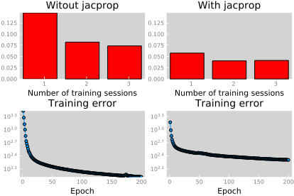
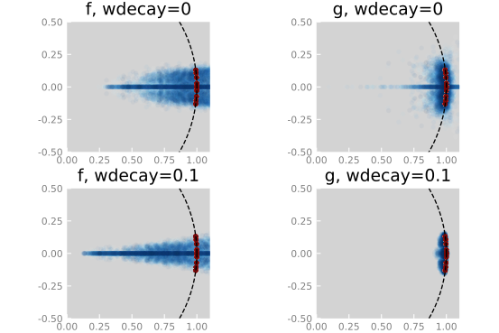

# JacProp

[](https://travis-ci.org/baggepinnen/JacProp.jl)

[](https://coveralls.io/github/baggepinnen/JacProp.jl?branch=master)

[](http://codecov.io/github/baggepinnen/JacProp.jl?branch=master)

This package implements [neural network training with tangent space regularization for estimation of dynamics models](https://arxiv.org/abs/1806.09919) of control systems on either of the forms

```
x' = f(x, u)     # ::System
x' - x = g(x, u) # ::DiffSystem
```

With tangent space regularization, we penalize the difference between the Jacobian of the model in two consecutive time-steps. This encodes the prior belief that the system is *smooth* along the trajectory. We accomplish this by fitting an LTV model using [LTVModels.jl](https://github.com/baggepinnen/LTVModels.jl) where we include the desired regularization term in the cost function, and sample this model around a trajectory to add training data to fit the neural network. This additional training data will hopefully respect the locally linear behavior of the system and will help prevent overfitting. The concept is illustrated below.

Pdf slides from ISMP, Bordeaux 2018, outlining the concept in greater detail, are available here [Slides (pdf)](docs/ismp_bagge.pdf)

# Linear system example
See the [pdf slides](docs/ismp_bagge.pdf) for introduction.

````julia
# weave("linear_sys_tmp.jl", doctype="github", out_path="build")
using Plots
default(grid=false)
using Parameters, JacProp, OrdinaryDiffEq, LTVModels, LTVModelsBase
using Flux: params, jacobian
using Flux.Optimise: Param, optimiser, expdecay

@with_kw struct LinearSys <: AbstractSystem
    A
    B
    N     = 1000
    nx    = size(A,1)
    nu    = size(B,2)
    h     = 0.02
    σ0    = 0
    sind  = 1:nx
    uind  = nx+1:(nx+nu)
    s1ind = (nx+nu+1):(nx+nu+nx)
end

function LinearSys(seed; nx = 10, nu = nx, h=0.02, kwargs...)
    srand(seed)
    A = randn(nx,nx)
    A = A-A'        # skew-symmetric = pure imaginary eigenvalues
    A = A - h*I     # Make 'slightly' stable
    A = expm(h*A)   # discrete time
    B = h*randn(nx,nu)
    LinearSys(;A=A, B=B, nx=nx, nu=nu, h=h, kwargs...)
end

function generate_data(sys::LinearSys, seed, validation=false)
    Parameters.@unpack A,B,N, nx, nu, h, σ0 = sys
    srand(seed)
    u      = filt(ones(5),[5], 10randn(N+2,nu))'
    t      = h:h:N*h+h
    x0     = randn(nx)
    x      = zeros(nx,N+1)
    x[:,1] = x0
    for i = 1:N-1
        x[:,i+1] = A*x[:,i] + B*u[:,i]
    end

    validation || (x .+= σ0 * randn(size(x)))
    u = u[:,1:N]
    @assert all(isfinite, u)
    x,u
end

function true_jacobian(sys::LinearSys, x, u)
    [sys.A sys.B]
end

function callbacker(epoch, loss,d,trace,model)
    i = length(trace) + epoch - 1
    function ()
        l = sum(d->Flux.data(loss(d...)),d)
        increment!(trace,epoch,l)
        i % 500 == 0 && println(@sprintf("Loss: %.4f", l))
    end
end

num_params = 30
wdecay     = 0
stepsize   = 0.02
const sys  = LinearSys(1, N=200, h=0.02, σ0 = 0.01)
true_jacobian(x,u) = true_jacobian(sys,x,u)
nu         = sys.nu
nx         = sys.nx
kalmanopts = [:P => 10, :R2 => 1000I, :σdivider => 20]
````


Generate validation data

````julia
function valdata()
    vx,vu,vy = Vector{Float64}[],Vector{Float64}[],Vector{Float64}[]
    for i = 20:60
        x,u = generate_data(sys,i, true)
        for j in 10:5:(sys.N-1)
            push!(vx, x[:,j])
            push!(vy, x[:,j+1])
            push!(vu, u[:,j])
        end
    end
    hcat(vx...),hcat(vu...),hcat(vy...)
end
vx,vu,vy = valdata()
vt = Trajectory(vx,vu,vy)
````
Generate training trajectories

````julia
trajs = [Trajectory(generate_data(sys, i)...) for i = 1:3]
````
### Without jacprop

````julia
srand(1)
models     = [DiffSystem(nx,nu,num_params, a) for a in default_activations]
opts       = ADAM.(params.(models), stepsize, decay=0.0005)
trainer  = ModelTrainer(;models=models, opts=opts, losses=JacProp.loss.(models), cb=callbacker, kalmanopts...)
for i = 1:3
    trainer(trajs[i], epochs=200, jacprop=0, useprior=false)
end
````


### With jacprop and prior

````julia
srand(1)
models     = [DiffSystem(nx,nu,num_params, a) for a in default_activations]
opts       = ADAM.(params.(models), stepsize, decay=0.0005)
trainerj  = ModelTrainer(;models=models, opts=opts, losses=JacProp.loss.(models), cb=callbacker, kalmanopts...)
for i = 1:3
    trainerj(trajs[i], epochs=200, jacprop=1, useprior=true)
end
````

### With jacprop no prior

````julia
srand(1)
models     = [DiffSystem(nx,nu,num_params, a) for a in default_activations]
opts       = ADAM.(params.(models), stepsize, decay=0.0005)
trainerjn  = ModelTrainer(;models=models, opts=opts, losses=JacProp.loss.(models), cb=callbacker, kalmanopts...)
for i = 1:3
    trainerjn(trajs[i], epochs=200, jacprop=1, useprior=false)
end
````

### Visualize result

````julia
pyplot(reuse=false)

mutregplot(trainer, vt, true_jacobian, title="Witout jacprop", subplot=1, layout=(2,2), reuse=false, useprior=false, showltv=false, legend=false, xaxis=(1:3), xaxis=(1:3))
mutregplot!(trainerjn, vt, true_jacobian, title="With jacprop", subplot=2, link=:y, useprior=false, showltv=false, legend=false, xaxis=(1:3))
traceplot!(trainer, subplot=3, title="Training error", xlabel="Epoch", legend=false)
traceplot!(trainerjn, subplot=4, title="Training error", xlabel="Epoch", legend=false)
````




The top row shows the error (Frobenius norm) in the Jacbians for several points sampled randomly in the state space. The bottow row shows the traing errors. The training errors are lower without jacprop, but he greater error in the Jacobians for the validation data indicates overfitting, which is prevented by jacprop.


## Weight decay
### Weight decay off

````julia
srand(1)
models     = [System(nx,nu,num_params, a) for a in default_activations]
opts       = ADAM.(params.(models), stepsize, decay=0.0005)
trainers  = ModelTrainer(;models=models, opts=opts, losses=JacProp.loss.(models), cb=callbacker, kalmanopts...)
for i = 1:3
    trainers(trajs[i], epochs=200, jacprop=1, useprior=false)
end
````
````julia

srand(1)
models     = [DiffSystem(nx,nu,num_params, a) for a in default_activations]
opts       = ADAM.(params.(models), stepsize, decay=0.0005)
trainerds  = ModelTrainer(;models=models, opts=opts, losses=JacProp.loss.(models), cb=callbacker, kalmanopts...)
for i = 1:3
    trainerds(trajs[i], epochs=200, jacprop=1, useprior=false)
end
````

### Weight decay on

````julia
wdecay = 0.1
srand(1)
models     = [System(nx,nu,num_params, a) for a in default_activations]
opts       = [[ADAM(params(models[i]), stepsize, decay=0.0005); [expdecay(Param(p), wdecay) for p in params(models[i]) if p isa AbstractMatrix]] for i = 1:length(models)]
trainerswd  = ModelTrainer(;models=models, opts=opts, losses=JacProp.loss.(models), cb=callbacker, kalmanopts...)
for i = 1:3
    trainerswd(trajs[i], epochs=200, jacprop=1, useprior=false)
end
````
````julia


srand(1)
models     = [DiffSystem(nx,nu,num_params, a) for a in default_activations]
opts       = [[ADAM(params(models[i]), stepsize, decay=0.0005); [expdecay(Param(p), wdecay) for p in params(models[i]) if p isa AbstractMatrix]] for i = 1:length(models)]
trainerdswd  = ModelTrainer(;models=models, opts=opts, losses=JacProp.loss.(models), cb=callbacker, kalmanopts...)
for i = 1:3
    trainerdswd(trajs[i], epochs=200, jacprop=1, useprior=false)
end
````

Visualize result

````julia
eigvalplot(trainers.models, vt, true_jacobian, title="f, wdecay=0", layout=4, subplot=1, markeralpha=0.05, ds=1, markerstrokealpha=0)
eigvalplot!(trainerds.models, vt, true_jacobian,  title="g, wdecay=0", subplot=2, markeralpha=0.05, ds=1, markerstrokealpha=0)
eigvalplot!(trainerswd.models, vt, true_jacobian,  title="f, wdecay=$wdecay", subplot=3, markeralpha=0.05, ds=1, markerstrokealpha=0)
eigvalplot!(trainerdswd.models, vt, true_jacobian,  title="g, wdecay=$wdecay", subplot=4, markeralpha=0.05, ds=1, markerstrokealpha=0)
plot!(link=:both, xlims=(0,1.1), ylims=(-0.5, 0.5))
````





## Different activation functions
This code produces the eigenvalue plots for different activation functions, shown in the [pdf slides](docs/ismp_bagge.pdf).
````julia
# ui = display_modeltrainer(trainerdswd, size=(800,600))

for acti in 1:4
    plot(layout=4, link=:both)
    actstr = string(JacProp.default_activations[acti])
    actstr = actstr[1:2] == "NN" ? actstr[7:end] : actstr
    for tri in 1:4
        tr = [trainers, trainerds, trainerswd, trainerdswd][tri]
        eigvalplot!([tr.models[acti]], vt, true_jacobian, title="$actstr, $(tri%2==0 ? "g" : "f"), wdecay=$(tri>2 ? wdecay : 0)", subplot=tri, markeralpha=0.05, ds=3, markerstrokealpha=0)
    end
    gui()
end
````

# References
https://arxiv.org/abs/1806.09919
@misc{1806.09919,
Author = {Fredrik Bagge Carlson and Rolf Johansson and Anders Robertsson},
Title = {Tangent-Space Regularization for Neural-Network Models of Dynamical Systems},
Year = {2018},
Eprint = {arXiv:1806.09919},
}
